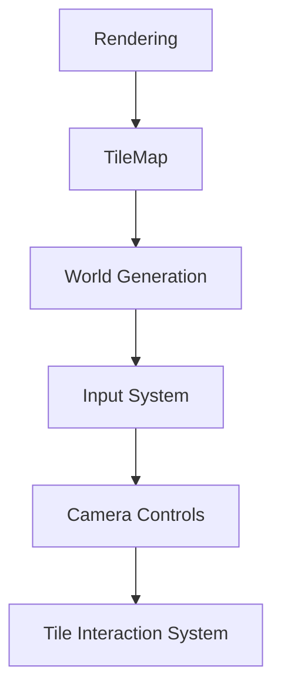

Welcome back! As mentioned in the previous post, this time around I'll be doing a technical deep dive into the systems that I will be re-architecting for the first version of the production branch.<!--more--> I began this process by taking a look at all the features I had implemented in sandbox and then created a plan for which features I wanted to tackle first. 

Here's the original list of Sandbox Features: 

- Rendering System
    - Sprite Sheets
      - Sprite Culling
     
- God Camera Controls 
     - Zoom
     - Pan

- World Generation
     - Basic Perlin-Noise Height Map

- Tile Interaction
     - Tiles stored in a TileMap 
     - Can click on a tile to see it's data, or delete it.

And here's the flowchart plan: 


{: .center}

# Rendering

The core goal I had in mind for the rendering pipeline was for the system to be fairly modular and require as little hand coding as possible when adding in additional sprites. I also wanted to make sure that the rendering system was built for rendering a lot of tiles on the screen at a given moment in time. With these two goals in mind, I decided that I wanted to make use of ggez's `SpriteBatch` feature. This allows me to queue up tiles using the same sprite into a batch, and then render the entire batch in the same draw call. To take this a step further, I decided that rather then use a sprite per tile, I could use spritesheets for similar entities resulting in the ability to batch together all sprites that use the same _sprite sheet_ rather then just the same _sprite_. However, before we get ahead of ourselves, the first thing we need to create would be some method of storing an entities positional data...

## Transforms

via a `Transform` component! The `Transform` component is actually quite trivial: 

```rust
// components.rs -- line: 54

pub struct Transform {
    pub position : math::Point2::<f32>,
    pub scale    : math::Vector2::<f32>,
}
```

Now by attaching a `Transform` component to an entity, we can store both it's world-position data as well as the object's scale.

It does have two additional [helper functions](https://github.com/abrigante1/boundless/blob/30747bdfb16fcf069d0819bf3b453dd41b638865/src/components.rs#L54) which are simply used to get a bounding box of the it's owning entity via either it's `Sprite` or a `Point2` containing the width/height of the bounding box. With the `Transform` out of the way, lets move back to Sprite Sheets and Sprite Batching.

## Sprite Sheets and Sprite Batching

To support these features, I created a few important data structures - the `AssetHandler` resource and the `Sprite` component. The `AssetHandler` is a pretty straight forward struct that looks like the following: 

```rust
// resources/asset_handler.rs

pub struct AssetHandler {
    pub asset_list : HashMap<String, SpriteBatch>,
}
```

Nothing too complex! I did implement a few [helper functions](https://github.com/abrigante1/boundless/blob/30747bdfb16fcf069d0819bf3b453dd41b638865/src/resources/asset_handler.rs#L14) onto the `AssetHandler`, but those are mainly for error checking and don't do anything non-trival. What the `AssetHandler` allows me to do, is have a single structure that contains the the `SpriteBatch` for a given spritesheet which is hashed under a string key that's nothing more then the file name of the spritesheet. Now, I can easily grab any of the loaded spritesheets and not worry about having a bunch of references laying around inside the `Sprite` component. Before we get to that, let's take a quick look at how we initalize the `AssetHandler`: 

```rust
// main.rs -- line: 156

// Loads all Sprite Assets into the AssetHandler
fn load_assets( ctx : &mut Context, asset_handler : &mut AssetHandler ) {

    asset_handler.add_asset(ctx, "/characters_spritesheet.png").expect("Asset Could Not Be Loaded!");
    asset_handler.add_asset(ctx, "/tiles_spritesheet.png").expect("Asset Could Not Be Loaded!");

}
```

Tada! It's actually quite straightforward and adding an additional asset only requires a line of code. The `Context` data structure use see in the function parameter arguments is an extremely important structure created by ggez. You need a reference to it to access a large number of ggez's tools. In this case, it's used to load the `Image` from a file: 

```rust
// resources/asset_handler.rs -- line: 30

let image = graphics::Image::new(ctx, asset_name).unwrap();
```

The created `Image` is then simply passed to a constructor for a `SpriteBatch` which is then stored in the `AssetHandler`. The next important data structure is the `Sprite` component -- this is a specs `Component` that stores a number of useful pieces of data that detail what spritesheet the entity uses and which individual sprite in the spritesheet is being requested. 

```rust
// components.rs -- line: 8
pub struct Sprite {
    pub spritesheet_dir: std::borrow::Cow<'static, str>,
    pub x_offset : u32,
    pub y_offset : u32,
    pub width    : u32,
    pub height   : u32,
}
```

If you aren't very familiar with Rust, you might be very confused at what type a `std::borrow::Cow<'static, str>` is, and if I'm being quite honest - I'm not exactly sure either! Rust handles strings very differently then C++ does, and it's been taking me a bit to get my head completely wrapped around how exactly they work. In turn, when trying to figure out how to store a string on a struct - I found the `Cow` type via how Amethyst implements it's `Named` component. From what I understand at the moment, `Cow` stands for "Copy on Write" and essentially will always perform a string copy rather then a string move on write to the variable. I plan on spending a bit more time brushing up on strings in Rust to better understand whats going on here and once I do I'll probably make a follow-up post and then edit in a reference to that here. 

Moving past the `Cow` complexities, what we have stored in the `Sprite` component are essentially five pieces of data that describe the specific sprite the component is referring to. The `spritesheet_dir` contains the filename of the spritesheet to use, and then the subsequent offset variables refer to the coordinate of the top left pixel of the desired sprite. From that, the width/height variables are pretty obvious in function - they are the width and the height of the given sprite in the spritesheet.  

Now that we have an `AssetHandler` struct that contains all the SpriteBatches, and a `Sprite` component that can attach to an entity and specify both it's spritesheet and it's sprite. With these two data structures, we can move onto another important piece of the puzzle - Sprite Culling!

## Sprite Culling

Thanks to specs, sprite culling isn't actually terribly difficult. On a high-level, before we run the render system, we can iterate through the objects in the scene and check if they are within the camera's view frustum. Oh. A Camera. Right...we need a Camera before we can actually cull anything! The camera is primarily composed of two concepts, a `Camera` tag-component, and an `ActiveCamera` resource that stores the entity currently being used as the camera: 

```rust
// resources/active_camera.rs

pub struct ActiveCamera {
    pub entity : Option<specs::Entity>,
}
```
This is really all there is to the Camera! Since we know *which* entity is the camera, we can just grab it's transform and calculate the appropriate matrices to convert from world-coordinates into screen-coordinates. However, that isn't necessary for sprite culling, so we will come back to that later. Now that we have a camera, we can do a really basic point-inside-rect check to determine if an object is culled - since if any object's position is outside the camera's view rectangle, that object can be culled and thus not rendered. To accomplish this, I created a `Culled` tag-component which is attached inside the `CullingSystem`. Let's take a peek at the implementation for the `CullingSystem`: 

```rust
// systems/culling_system.rs

impl<'s> System<'s> for CullingSystem {
    type SystemData = (Entities<'s>,
                       Read<'s, ActiveCamera>,
                       Read<'s, ScreenDimensions>,
                       ReadStorage<'s,  components::Transform>,
                       WriteStorage<'s, components::Culled>);

    fn run(&mut self, (entities, active_camera, screen_size, transforms, mut culled_ents) : Self::SystemData) {

        // Get the ActiveCamera's View Rect
        let camera_entity    = active_camera.entity.unwrap();
        let camera_transform = transforms.get(camera_entity).unwrap();
        let camera_rect      = camera_transform.get_rect_from_point(math::Point2::new(screen_size.x, screen_size.y));

        // Cull all Entities that whose Position is Not Inside the Camera's View Rect
        for (entity, transform) in (&entities, &transforms).join() {
            if camera_rect.contains(transform.position) {
                culled_ents.remove(entity);
            } else {
                culled_ents.insert(entity, components::Culled {}).expect("Could not add 'Culled' Tag");
            }
        }

    }
}
```

Due to some of the needed boilerplate code for a specs `System` it looks a bit more complicated then it really is. However, I did want to note that I also needed to create a `ScreenDimensions` resource that can be used within a system to get the current size of the screen. I do feel like this is a bit clunky, but I couldn't see another way without adding to the complexity of the `ActiveCamera` resource, but that may be an avenue I prototype in sandbox should I feel it necessary. Back to the `CullingSystem` -- All the primary logic can be found inside the `run(...)` function. We simply grab the camera from the `ActiveCamera`, compute it's bounding box, and then iterate through all entities and checking if they are within the camea's view rect. If they aren't within view, I simply attach the `Culled` tag and if they are withing view, I remove it. With all the entities appropriately tagged for culling, we can now properly implement a rendering system!

## The Render System

Getting the a render system implemented the way I wanted was a bit tricky! I originally was hoping to have rendering be a proper specs system, but quickly realized that wouldn't be possible without having the system store a reference to the ggez `Context` and I'm not yet comfortable enough with Rust's borrow checker to understand how it wants me to store a reference inside a struct. As a result, I decided to turn the rendering system into what I've dubbed a "pseudosystem" which just means I wrote ecs logic inside a non-specs system and then call it's update manually every frame which in this case, is specifically every *draw* frame. Here's what the `RenderSystem` looks like: 

```rust
// systems/render_system.rs

// Renders the Current Scene
pub struct RenderSystem {}

impl RenderSystem {
    pub fn draw(&mut self, ctx : &mut ggez::Context, world: &World) {
        
        graphics::clear(ctx, [0.1, 0.2, 0.3, 1.0].into());

        let (w, h) = graphics::drawable_size(ctx);

        let sprites           = world.read_storage::<crate::components::Sprite>();
        let transforms        = world.read_storage::<crate::components::Transform>(); 
        let culled_ents       = world.read_storage::<crate::components::Culled>();

        let camera            = world.read_resource::<crate::resources::ActiveCamera>().entity;
        let camera_transform  = transforms.get(camera.unwrap()).unwrap();

        let mut asset_handler = world.write_resource::<crate::AssetHandler>();

        // Add All Visible Sprites to the Batch
        for (sprite, transform, _) in (&sprites, &transforms, !&culled_ents).join() {

            let spritesheet = asset_handler.get_asset(&sprite.spritesheet_dir).unwrap();

            let rect = spritesheet.clone().into_inner().dimensions();

            let screen_pos = camera_utils::world_to_screen(&camera_transform,math::Point2::new(w, h))  
                             * math::Point3::new(transform.position.x, transform.position.y, 1.0);

            // Creates the Draw Params that selects the image from the SpriteSheet and Scales it Appropriately
            let draw_params = graphics::DrawParam::new()
                .src(graphics::Rect::fraction(sprite.x_offset as f32, sprite.y_offset as f32, sprite.width as f32, sprite.height as f32, &rect))
                .offset(math::Point2::new(0.5, 0.5))
                .scale(math::Vector2::new(1.0, 1.0))
                .dest(math::Point2::new(screen_pos.x, screen_pos.y));

            spritesheet.add(draw_params);
        }

        // Draw the Batch
        for ( _ , spritesheet) in &mut asset_handler.asset_list {
            graphics::draw(ctx, spritesheet, graphics::DrawParam::new()).expect("Failed to load Image!");
            spritesheet.clear();
        }

        graphics::present(ctx).expect("Failed to present!");

    }
}
```

Woah! That's the largest code snippet yet! Once again, this might be a little deciving, as it's actually pretty straightforward! The first few lines of the `draw()` function are where I request the appropriate component `Storage` from the specs `World`, as well as any resources I need -- such as the `ActiveCamera` and `AssetHandler`. Then, once I have all the appropriate tools I need, I just go right ahead and perform a `join()` operation on all the entities that *have* `Sprite` and `Transform` components but _not_ a `Culled` component attached. So as long as I call the `RenderSystem` after I call the `CullingSystem`, all of the sprites that aren't visible by the camera will get culled since they have a `Culled` component attached - neat! It's features like these that have made me really enjoy working with specs and designing for the Entity-Component System architecture. 

This `join()` loop is where the bulk of the rendering occurs, but it's still rather trivial. All I need to do is grab the entity's spritesheet name from the sprite component, pass it to the `AssetHandler` to grab the appropriate `SpriteBatch` configure the `DrawParams` for the current entity, and then add it to the `SpriteBatch`! Unlike for the `CullingSystem`, however, this time we do need to perform some coordinate conversions. It's fairly simply so I won't go into the details, but if your curious as to how I got those working - you can find the implementations [here](https://github.com/abrigante1/boundless/blob/production/src/utils/camera_utils.rs).

The final `for` loop is where the actual `SpriteBatch` draw call is. This loops though the `AssetHandler`'s assets, and using Rust's nifty tuple destructuring, I can directly grab the `SpriteBatch` from the list and draw the batch in one draw call. This results in us doing only a single draw call per spritesheet, which is pretty awesome. Right after the loop, you simply call the present function with the provided `Context` and voila - things are rendering!


And that's a wrap! With our rendering system done, up next I'll be porting the TileMap data structure over into production. I have a few ideas on how I want to go about doing this, and I'm pretty excited for how it will turn out. See you then!