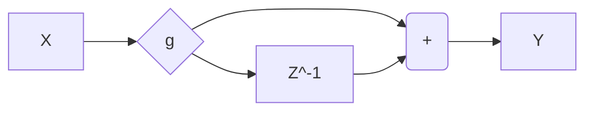

Hey - Welcome to my new website!

<!--more-->

If you're reading this, it means I got everything up and running - woohoo!

This website is going to be where I post devlogs on projects, host my resume, as well as my portfolio. 
I previously had this site hosted on Squarespace, but it didn't provide me with the toolchain I was hoping it would, so I switched to GitHub Pages. 
As a result, this site is built using Jekyll alongside a modified version of the [TeXT](https://tianqi.name/jekyll-TeXt-theme/) Jekyll theme. 

I'm quite excited to see where this goes next, as now I have some pretty sweet tools on my hand thanks to Markdown and Jekyll!

Here are some of the things I can do!

## Examples

Via Headers, the site will automatically generate a Table of Contents that can be seen in the aside to the right -- err, on desktop at least, hoping to support mobile soon with via a sidebar!

### Inline Code

```cpp
#include <iostream>

int main(void)
{
    std::cout << "Hello, Internet!" << std::endl;
    return 0;
}
``` 

### Inline Math

$$X_k = \sum_{n=0}^{N-1} {x_n e^{ -{ {2 \pi i} \over N} k n } }$$

### Inline Graph



