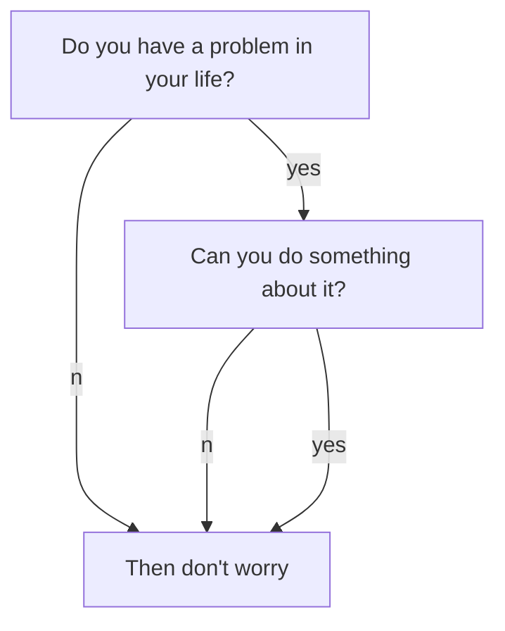

# Welcome!

Hey! Glad to see your reading this, that means I got this working :D

<!--more-->

Hopefully soon there will be neat posts about things I'm developing, alongside a port of my old site.

## This is a heading test

I'm testing things here, you can stop reading!

### Code Test

```cpp
#include <iostream>

int main(void)
{
    std::cout << "Hello Internet!"  << std::endl;

    return 0;
}
```

### Math Test

When $$a \ne 0$$, there are two solutions to $$ax^2 + bx + c = 0$$ and they are
$$x_1 = {-b + \sqrt{b^2-4ac} \over 2a}$$
$$x_2 = {-b - \sqrt{b^2-4ac} \over 2a} \notag$$

### Graph Test

